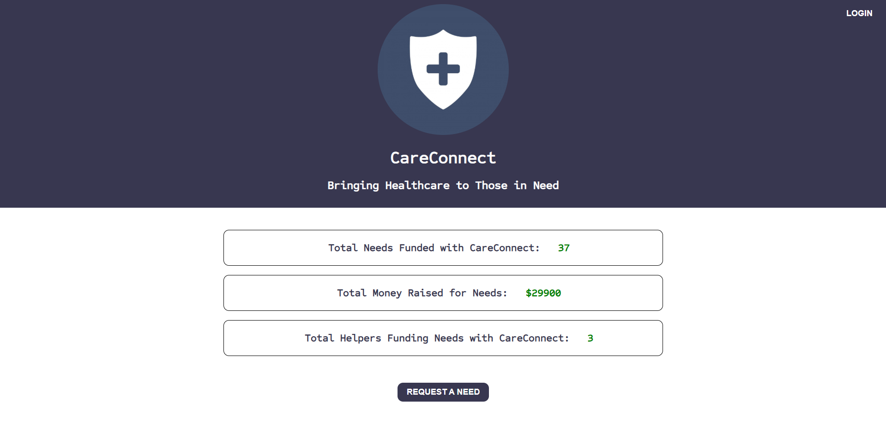
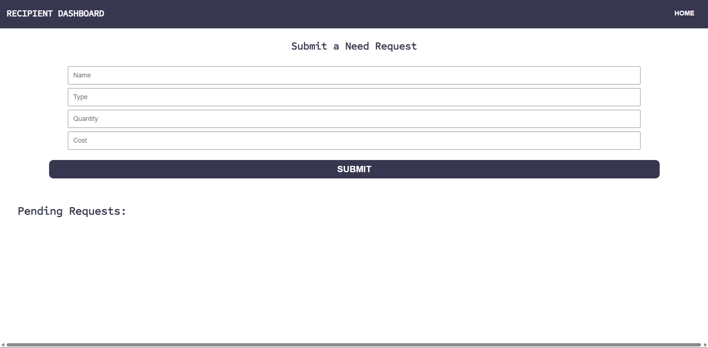
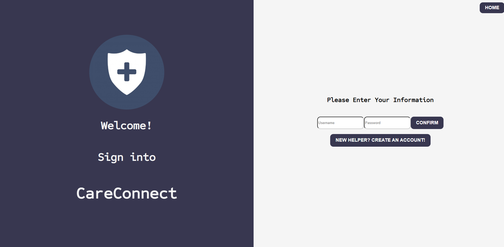
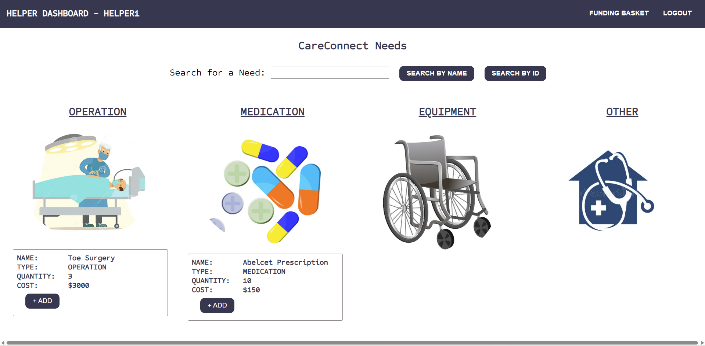

<p align="center">
  
</p>

<h1 align="center">CareConnect</h1>

<p align="center"><em>Bringing Healthcare to Those in Need</em></p>

A full-stack web application that connects people who need healthcare with helpers who fund those needs. It is built with **TypeScript** and **Angular** on the front end and **Java Spring** on the back end. Testing uses **JUnit**, with **JaCoCo** for code coverage reporting and **Mockito** for mocking dependencies in unit tests.

## Tech Stack

| Area | Technology |
| --- | --- |
| Front end | TypeScript 5.1, Angular 16 |
| Back end | Java 17, Spring Boot 3.5 |
| Testing | JUnit 5 |
| Code coverage | JaCoCo |
| Mocking | Mockito |

## Screenshots

### Home Page



### Need Request Page



### Login Page



### User/Helper Dashboard



## Credits

Members who worked on this project:

- Christopher Obando
- Paul Vickers
- Sam June
- Tony Zheng

## Prerequisites

Install the following before running the project:

| Tool | Version | Used for |
| --- | --- | --- |
| [Git](https://git-scm.com/downloads) | Latest | Cloning the repo |
| [JDK](https://adoptium.net/) | 17 or newer | Running and building the Spring API |
| [Maven](https://maven.apache.org/download.cgi) | 3.6.3 or newer | Building the API and running its tests |
| [Node.js](https://nodejs.org/) | 18.10 or newer (Angular 16 requires 16.14+ or 18.10+) | Running the Angular UI |

Confirm everything is installed:

```bash
git --version
java -version
mvn -v
node -v
```

The Angular CLI is installed with the project's dependencies, so a global install is optional. If you want the `ng` command available everywhere:

```bash
npm install -g @angular/cli
```

Then install the UI's dependencies once, before the first run:

```bash
cd careconnect-ui/UI
npm install
```

## Getting Started

Start the API first, then the UI. The UI expects the API at `http://localhost:8080`.

### Start the API (dev server)

```bash
cd careconnect-api/
mvn spring-boot:run
```

### Start the UI

```bash
cd careconnect-ui/UI
ng serve
```

Run `ng serve` for a dev server. Navigate to `http://localhost:4200/`. The application will automatically reload if you change any of the source files.

If `ng` isn't found, run `npm start` instead, which uses the Angular CLI installed with the project.

## Running the Tests

API tests (JUnit and Mockito):

```bash
cd careconnect-api/
mvn clean test
```

The JaCoCo coverage report is generated in `careconnect-api/target/site/jacoco/`.

UI tests (Karma and Jasmine, requires Chrome):

```bash
cd careconnect-ui/UI
ng test
```