# CareConnect Design Documentation

## Team Information
* Team name: CareConnect Developers
* Team members
  * Paul Vickers
  * Sam June
  * Tony Zheng
  * Christopher Obando

## Executive Summary

This is a summary of the project.

### Purpose
>  _**[Sprint 2 & 4]** Provide a very brief statement about the project and the most
> important user group and user goals._

> CareConnect's goal is to make outstanding Medical and Healthcare Needs known to the public,
> where volunteers known as Helpers can choose to fund them.
> This project delivers an easy to navigate user-interface to make the funding process easy for
> Helpers, and features an easy-to-use Admin-Dashboard that allows the System Manager to access and modify
> CareConnect's Cupboard of Needs quickly and easily.

### Glossary and Acronyms
> _**[Sprint 2 & 4]** Provide a table of terms and acronyms._

| Term | Definition |
|------|------------|
| Need | A single medical or healthcare need, with the format (ID, Name, Type, Quantity, Cost). |
| Cupboard | Refers to the entire collection of Needs. |
| Helper | A user meant to be able to view the Cupboard and select Needs for funding. |
| Manager | A user meant to be able to perform CRUD operations on the Cupboard. |
| Funding Basket | Stores a collection of Needs that a Helper has considered for funding. |
| Recipient | A user who can submit a Need request. The request can be approved or denied by the Manager. |

## Requirements

This section describes the features of the application.

> _In this section you do not need to be exhaustive and list every
> story.  Focus on top-level features from the Vision document and
> maybe Epics and critical Stories._

### Definition of MVP
> _**[Sprint 2 & 4]** Provide a simple description of the Minimum Viable Product._
> The Cupboard reliably stores needs in a JSON file, where it can be accessed and displayed by both
> the Helpers and the Manager. The Helper can view the Cupboard, can add Needs to and from a Funding Basket, and
> can choose to check-out with the Needs inside it. The Manager can likewise view the Cupboard, but also has
> administrative permissions to add, edit, or delete Needs from it. A Manager is unable to view the contents of
> any Funding Basket. Helpers and Managers are both redirected to their respective dashboards through a Log-In
> Page. 

### MVP Features
>  _**[Sprint 4]** Provide a list of top-level Epics and/or Stories of the MVP._

### Enhancements
> _**[Sprint 4]** Describe what enhancements you have implemented for the project._

## Application Domain

This section describes the application domain.

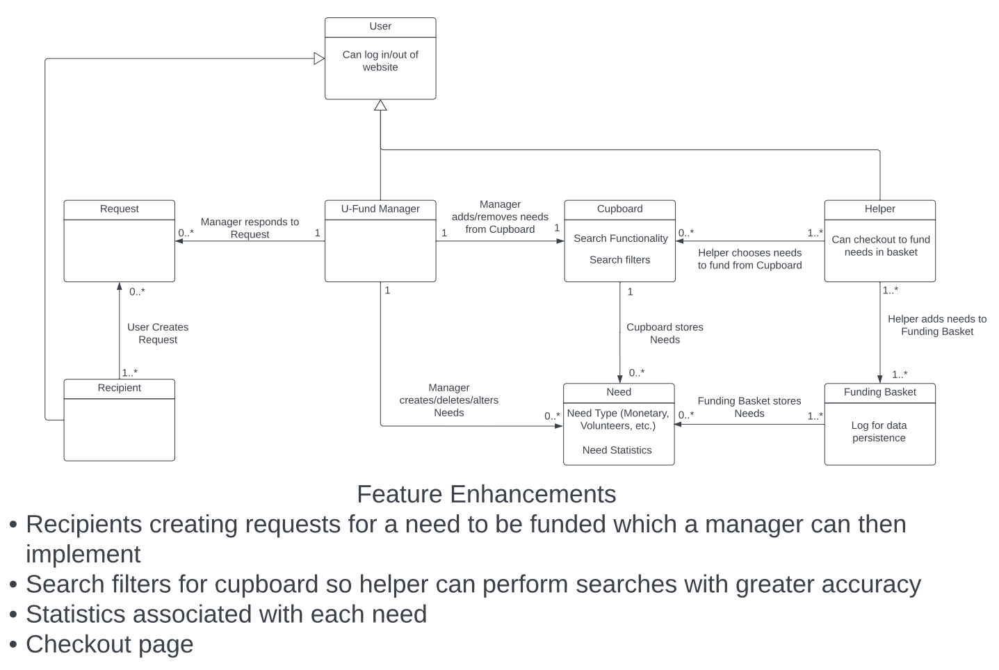

> _**[Sprint 2 & 4]** Provide a high-level overview of the domain for this application. You
> can discuss the more important domain entities and their relationship
> to each other._

## Architecture and Design

This section describes the application architecture.

### Summary

The following Tiers/Layers model shows a high-level view of the webapp's architecture. 
**NOTE**: detailed diagrams are required in later sections of this document. (_When requested, replace this diagram with your **own** rendition and representations of sample classes of your system_.) 

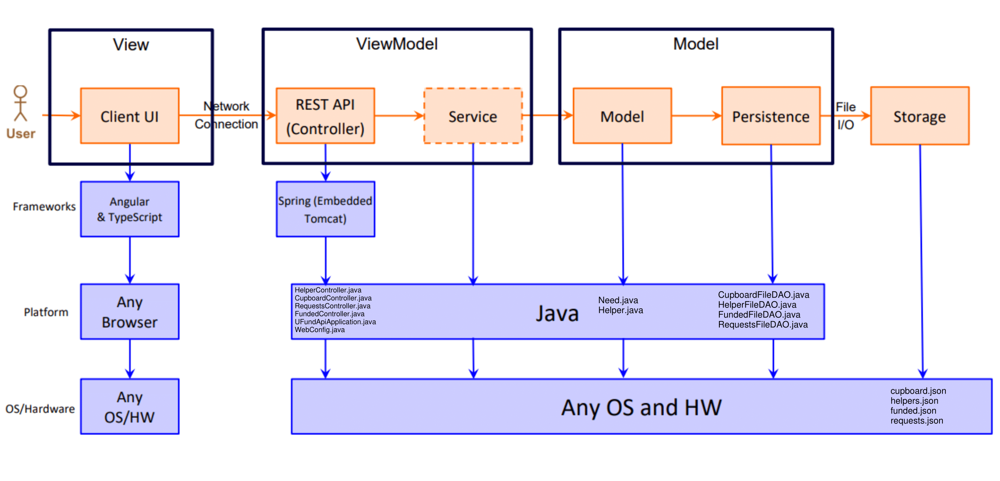

The web application, is built using the Model–View–ViewModel (MVVM) architecture pattern. 

The Model stores the application data objects including any functionality to provide persistance. 

The View is the client-side SPA built with Angular utilizing HTML, CSS and TypeScript. The ViewModel provides RESTful APIs to the client (View) as well as any logic required to manipulate the data objects from the Model.

Both the ViewModel and Model are built using Java and Spring Framework. Details of the components within these tiers are supplied below.

### Overview of User Interface

This section describes the web interface flow; this is how the user views and interacts with the web application.

> _Provide a summary of the application's user interface.  Describe, from the user's perspective, the flow of the pages in the web application._
> When a user opens the web application, they will be greeted with a login screen.
>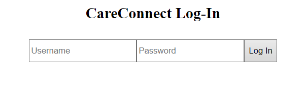
>
> Depending on what the user inputs as their username and password they will be brought to two different pages. If they input their **Helper** credentials, they will be brought to the Helper screen, and if they input the admin credentials, they will be brought to the admin page.
> 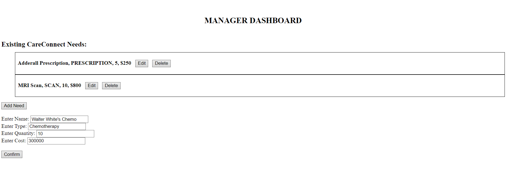
>
> Clicking on the "Add Need" button will open an add need menu where the user can specify the parameters (name, type, quantity, cost) for a new **Need**. After filling out the fields, they can click "Confirm" to finalize adding the need to the cupboard.
> 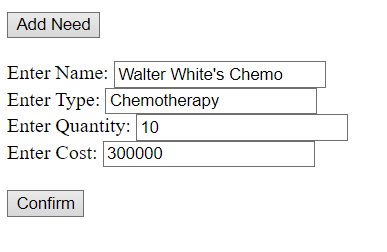
>
> Clicking on "Edit" will open a menu underneath the selected need similar to the add need menu. To make changes to a parameter, the user inputs the value they want the parameter to be changed to, and for parameters they don't want to change, the original value is rewritten. All fields must be filled out in order to go through with the update. Clicking on "Delete" will delete the selected **Need**.
> 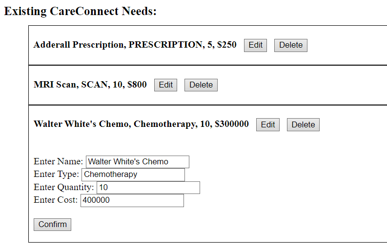
>
> Another thing to note is to retract the edit or add need menus, all the user has to do is press their respective buttons again
>
> Going back to the **Helper** user interface, after the user inputs their credentials, they will be brought to the search needs page, where they can search the cupboard for any **Need**s they want to fund.
> 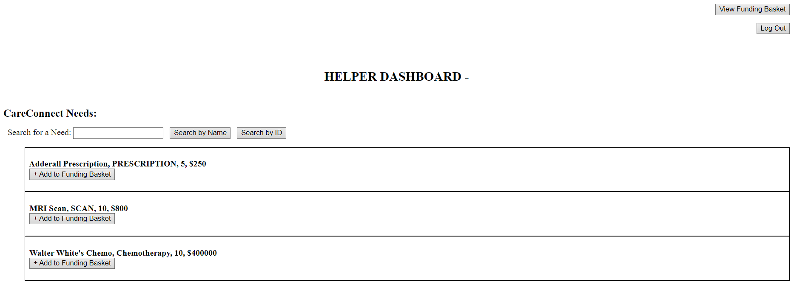
> 
> Currently there are two ways of searching for needs, 1) "Search by Name" and 2) "Search by ID".
> 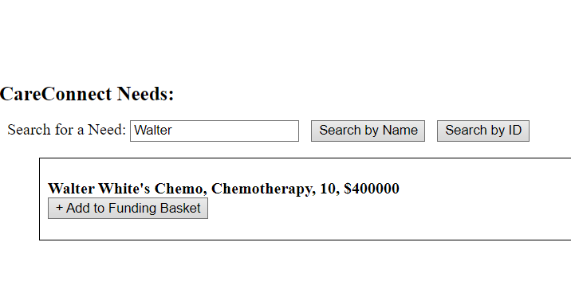
>
> To add a **Need** to a funding basket, click on the "Add to Funding Basket" button.
> 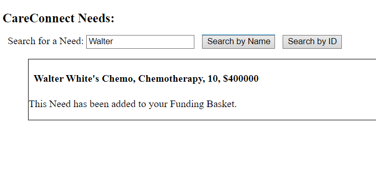
>
> Clicking on the "View Funding Basket" button takes the user to their funding basket where they can see all the needs they want to fund, and clicking on the "Remove" button will remove that **Need** from their funding basket.
> 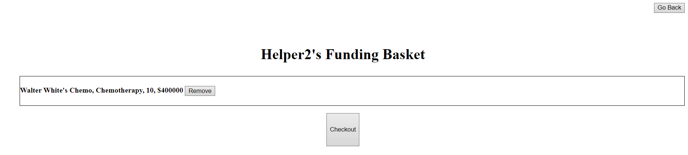
>
> On the top right corner for both the admin and **Helper**s is a "Log Out" button. Clicking this will take the user back to the Login page.

### View Tier
> _**[Sprint 4]** Provide a summary of the View Tier UI of your architecture.
> Describe the types of components in the tier and describe their
> responsibilities.  This should be a narrative description, i.e. it has
> a flow or "story line" that the reader can follow._

> _**[Sprint 4]** You must  provide at least **2 sequence diagrams** as is relevant to a particular aspects 
> of the design that you are describing.  (**For example**, in a shopping experience application you might create a 
> sequence diagram of a customer searching for an item and adding to their cart.)
> As these can span multiple tiers, be sure to include an relevant HTTP requests from the client-side to the server-side 
> to help illustrate the end-to-end flow._

> _**[Sprint 4]** To adequately show your system, you will need to present the **class diagrams** where relevant in your design. Some additional tips:_
 >* _Class diagrams only apply to the **ViewModel** and **Model** Tier_
>* _A single class diagram of the entire system will not be effective. You may start with one, but will be need to break it down into smaller sections to account for requirements of each of the Tier static models below._
 >* _Correct labeling of relationships with proper notation for the relationship type, multiplicities, and navigation information will be important._
 >* _Include other details such as attributes and method signatures that you think are needed to support the level of detail in your discussion._

### ViewModel Tier
> _**[Sprint 4]** Provide a summary of this tier of your architecture. This
> section will follow the same instructions that are given for the View
> Tier above._

> _At appropriate places as part of this narrative provide **one** or more updated and **properly labeled**
> static models (UML class diagrams) with some details such as critical attributes and methods._
> 

### Model Tier
> _**[Sprint 2, 3 & 4]**
> 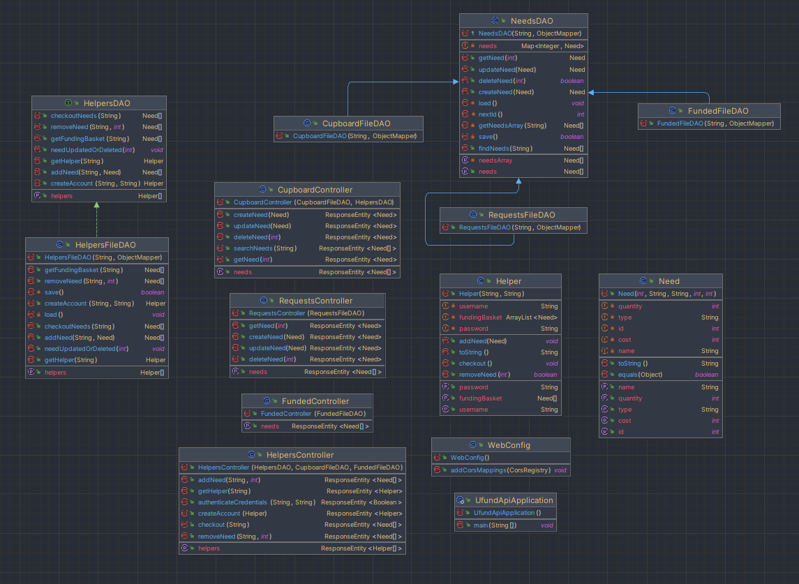
> 
> Contained within the Model is the representation of a **Need** object and a **Helper** object. The **Need** object represents a good or service
that a **Helper** wants to fund. Within the class contains an id, a name, type, quantity, and a cost.
>
> The **Helper** object represents a user that wants to fund **Need**s. The **Helper** class holds the helper's username, password, and their funding basket, which holds the **Need**s that they want to fund.
>
> 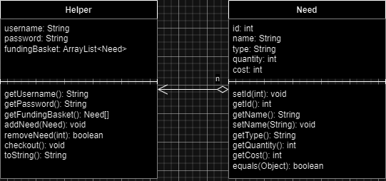
>
> Classes that maintain persistence of the data are the **HelperFileDAO**, **CupboardFileDAO**, **FundedFileDAO**, and **RequestsFileDAO** classes along with the **HelperDAO** interface and the **NeedsDAO** abstract class, which is extended by every FileDAO file. The **NeedsDAO** class is used by any FileDAO class that has to interact with a need in some capacity. For instance, **CupboardFileDAO** is responsible for the CRUD operations of **Need**s and storing those **Need**s in a cupboard.json file (or cupboard for short); **FundedFileDAO** is responsible for recording any **Need**s that have been funded to completion in the funded.json file; **RequestsFileDAO** is responsible for submitting **Need**s to the requests.json file before it is either approved or denied by an admin. If the request is approved, the **Need** is added to the cupboard, and if it's denied, the **Need** is removed from requests.json.
**HelperFileDAO** also extends the **NeedsDAO** file because **Helper**s have to interact with **Need**s if they want to help fund **Need**s. However, since there are methods unrelated to **Need**s used by **HelperFileDAO**, like authenticating users, it also implements a **HelperDAO** interface that outlines the remaining methods used by **HelperFileDAO**.
>
> 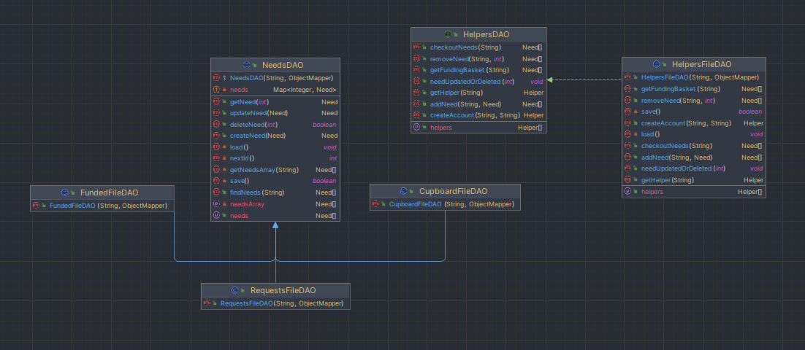
>
> The controller classes allow for the user to send HTTP requests to the API and receive responses from the API. When the API is initialized, the controller class initializes an instance or instances for DAO classes for each controller: **CupboardController**, **FundedController**, **RequestsController**, and **HelperController**. When a HTTP request is received by any of the controllers, they will forward the correct message to the corresponding DAO file(s), which will then update data and provide persistence for the data.
> 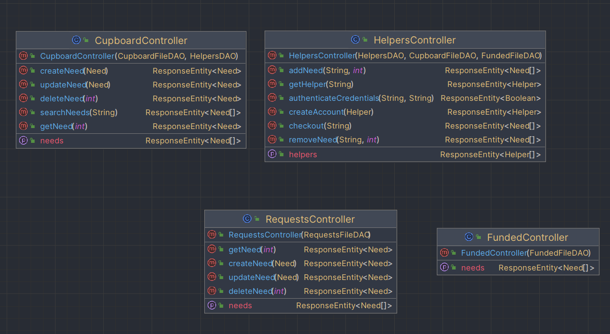

> _At appropriate places as part of this narrative provide **one** or more updated and **properly labeled**
> static models (UML class diagrams) with some details such as critical attributes and methods._
> 

## OO Design Principles
> _**[Sprint 2, 3 & 4]** Will eventually address upto **4 key OO Principles** in your final design. Follow guidance in augmenting those completed in previous Sprints as indicated to you by instructor. Be sure to include any diagrams (or clearly refer to ones elsewhere in your Tier sections above) to support your claims._

> _**[Sprint 3 & 4]** OO Design Principles should span across **all tiers.**_

> **Dependency Inversion/Injection**: Dependency Inversion/Injection is the basic idea that high level classes should not be built from low level classes, and low level classes should not be made in the vision of a singular high level class. Ideally both high level and low level classes are dependent on an abstract class/interface.
>
> The definition of dependency inversion/injection is hard to conceptualize but with the help of an example, it can be better visualized. For example, in the helper domain, there is a HelperFileDAO class, which is responsible for modifying the data of the Helpers that use the product and there is a HelperController class, which is responsible for passing commands given from the user, to the HelperFileDAO class (this is partially inaccurate but for the sake of continuity in the example the inaccuracy will be addressed later). Instead of only having the FileDAO and controller class, with the controller class borrowing code from the DAO class, they both are dependent on a DAO interface, with the HelperFileDAO being a concrete implementation of the HelperDAO class, and instead of the HelperController class directly calling functions from the HelperFileDAO class, it calls the methods listed within the **HelperDAO** interface.
>
> When we run unit tests on HelperController, we are able to isolate the class with this technique and solely look at the class being tested and replace any dependencies with mock objects to limit the scope to the class being tested.
>
> 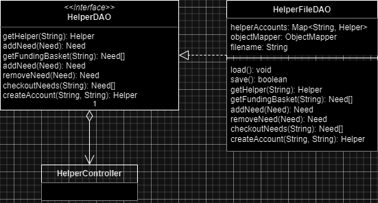

> **Open/Closed Principle**: The Open/Closed principle states that classes within a system should be **open** for extension but **closed** to modification, which sounds confusing on face value but elaborating on how to implement this principle should make the idea more clearer. By using abstract classes (polymorphism) and/or interfaces, we are able to have classes that implement those base similarities while being able to add on or "extend" to the different classes.
>
> In our design for Sprint 2, the Open/Closed Principle can be observed in the CupboardFileDAO class and the interface it implements, CupboardDAO. The CupboardFileDAO class can implement the methods in the interface in its own way and also define some of its own independent methods such as getNeedsArray() or nextId(). This also leaves us open to flexibility in the future if we ever wanted to change how we store data, such as using a database.
>
> 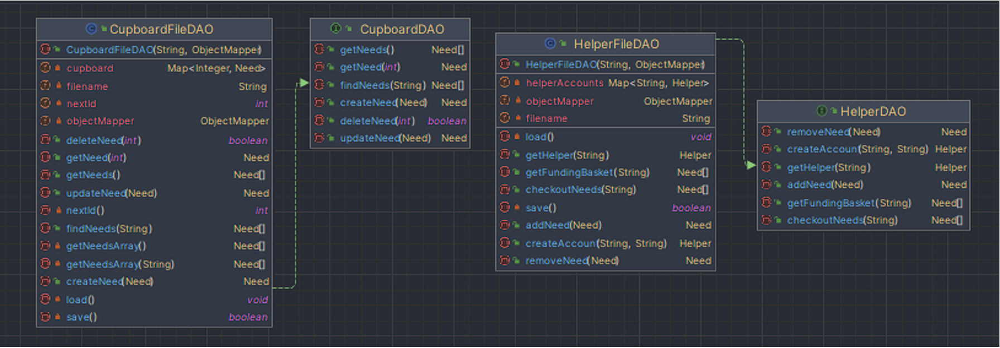
> 
> In Sprint 3, we expanded upon and improved our usage of the Open/Closed principle. We realized that, because of our feature enhancements, it would be necessary to store three different JSON files which only contain need objects. This made the usage of abstraction and polymorphism very effective, and so we created an abstract class called NeedsDAO which contained all the original functionality of the CupboardDAO interface as well as the CupboardFileDAO implementations. Then, for each file (cupboard.json, requests.json, and funded.json) we simply created an associated DAO (FundedFileDAO, RequestsFileDAO, and CupboardFileDAO) which would call super() in its constructor and use all the functionality given in the NeedsDAO abstract class. So each of these DAOs that extend the abstract class simply have a constructor in which a different filename is used. Then, if we wanted to have functionality specific to one of the files, we could add those methods, but the base functionality will always be provided through NeedsDAO and that demonstrates the Open/Closed principle.  
>
> 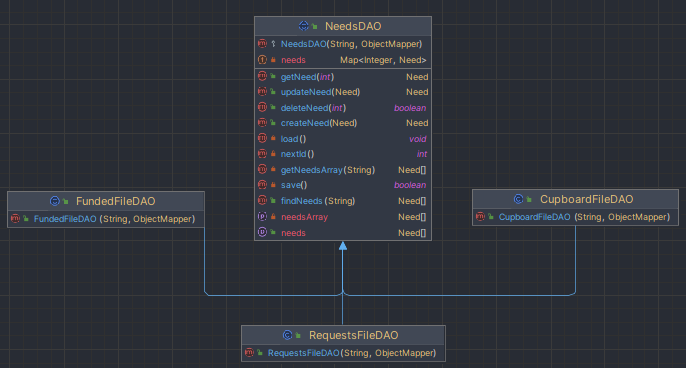

> **Low Coupling Principle**: In Software Engineering, Low Coupling is the practice of making components and modules of a software system independent of each other. One module should have minimal knowledge of the inner workings of other modules, and changes reflect in one class should have minimal effects on other classes. However, it's important that the complexity of a system isn't sacrificed just to get lower coupling and fewer relationships between classes; in the list of priorities when designing a system, low coupling should not be at the top, and coupling should not be lowered just to reduce the number of relationships in a system.
> 
> While the other two principles above were talked about in relation to our Model Tier, Low Coupling can be seen and is implemented in many places in our View tier. A great example of this is the username service in our frontend, which is used specifically to store a username across a session as well as make API calls to authenticate credentials and create new user accounts. Two of our components, helper-dashboard and funding-basket, then use the username service to retrieve the needs and funding basket of that specific user, and perform necessary operations for that user. These two dashboards don't need knowledge of how the username service works; all they need to know is that there is a getUsername() function that they can call, and this perfectly demonstrates the Low Coupling principle.
> 
> 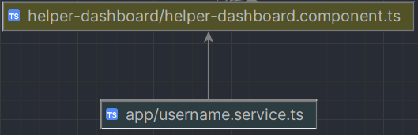
> 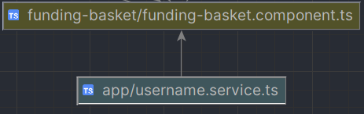

## Static Code Analysis/Future Design Improvements
> _**[Sprint 4]** With the results from the Static Code Analysis exercise, 
> **Identify 3-4** areas within your code that have been flagged by the Static Code 
> Analysis Tool (SonarQube) and provide your analysis and recommendations.  
> Include any relevant screenshot(s) with each area._

> _**[Sprint 4]** Discuss **future** refactoring and other design improvements your team would explore if the team had additional time._

## Testing
> _This section will provide information about the testing performed
> and the results of the testing._

### Acceptance Testing
> _**[Sprint 2 & 4]** Report on the number of user stories that have passed all their
> acceptance criteria tests, the number that have some acceptance
> criteria tests failing, and the number of user stories that
> have not had any testing yet. Highlight the issues found during
> acceptance testing and if there are any concerns._
>
> Out of the 13 user stories listed in the Acceptance Test Plan, 11 of them passed.
> 
> In the acceptance testing, only two of the acceptance criteria did not pass. Fortunately the criteria was only for little things, such as having the API display a message when there are no needs currently in the cupboard. The other was with authenticating login requests on the frontend, we did not implement that just yet. One issue with the acceptance criteria themselves is how they are written. Because we were used to writing acceptance criteria only for the API, some of the criteria were not written with the UI in mind, and therefore some of the acceptance criteria can be a bit confusing as it works in our API but not in our UI.

### Unit Testing and Code Coverage
> _**[Sprint 4]** Discuss your unit testing strategy. Report on the code coverage
> achieved from unit testing of the code base. Discuss the team's
> coverage targets, why you selected those values, and how well your
> code coverage met your targets._

> _**[Sprint 2 & 4]** **Include images of your code coverage report.** If there are any anomalies, discuss
> those._
>
> **Model Code Coverage**
> Our model is very well tested as should be expected, model tests are very easy to write. As for the Need class, the only thing keeping us from 100% is that we didn’t thoroughly test the equals() method that we wrote, specifically a test case for when it should return false if the object is a different class.
> 
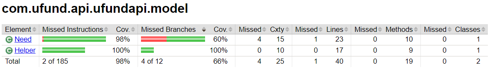

> **Persistence Code Coverage**
> Our persistence tier classes are pretty well tested overall. We just missed some tests that are meant to check exceptions and make sure that they are thrown similar to above, but for all of the methods in both these classes we have ample testing.
> 
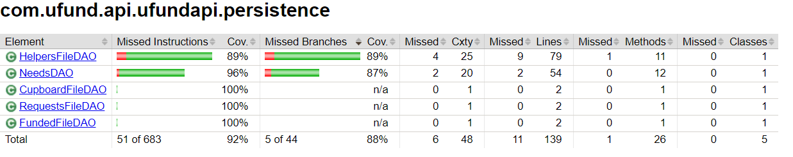

> **Controller Code Coverage**
> It does seem that our cupboard controller is very well tested, with 100% coverage. As for the helper controller, all of our methods are tested, but we didn’t write tests to make sure that the errors are thrown correctly, so that’s why the coverage is a bit lower.
> 
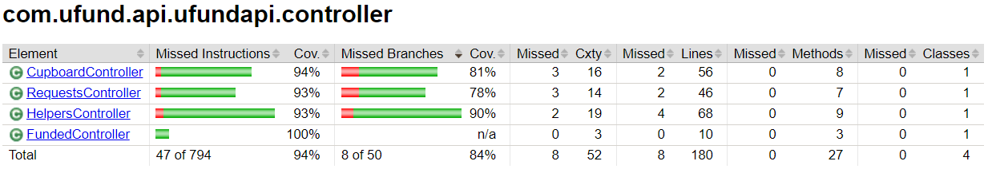
